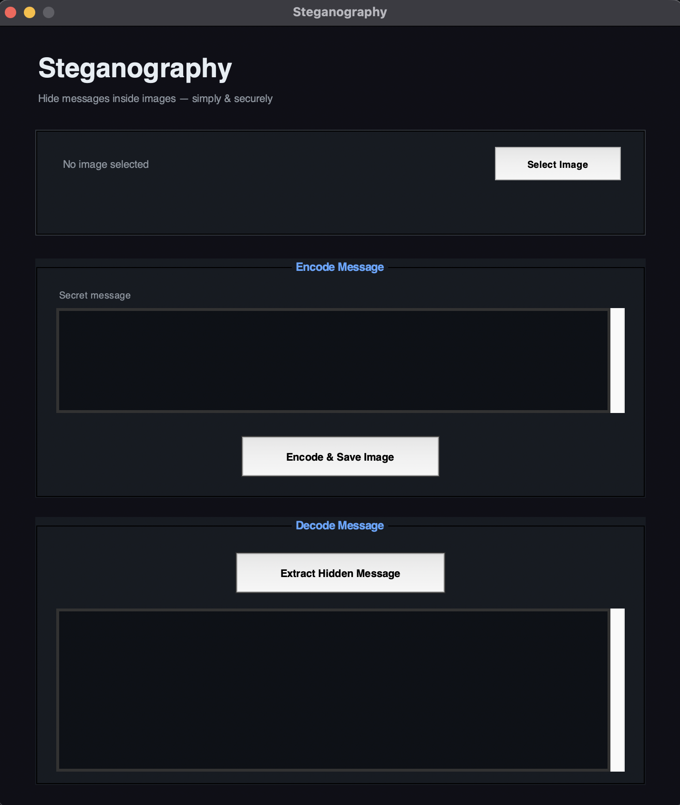

# Steganography Tool

Steganography tool is used for hiding secret information within the file that looks ordinary such as document, images, videos and audio files etc. The hidden data can only extracted by authorized party.

## Learning Objective

## Key Features

- Hides messages in image pixels
- Clean Tkinter interface
- Tests all modules individually and together
- Validates inputs and handles errors

## Project Stucture

```
steganography-project/
│
├── main.py                      # Main entry point
├── gui.py                       # GUI implementation (Tkinter)
├── image_operations.py          # Image loading/saving operations
├── encode.py                    # Message encoding functions
├── decode.py                    # Message decoding functions
├── test_steganography.py        # Unit tests
└── README.md                    # This file
```

## Run Locally

```bash
# Clone the repository
https://github.com/0xh4ck3rm4n/stegenography-tool-coursework.git
cd stegenography-tool-coursework

# You need requirements file with dependencies
pip install -r requirements.txt

# Run code
python main.py
```

Expected Output :

