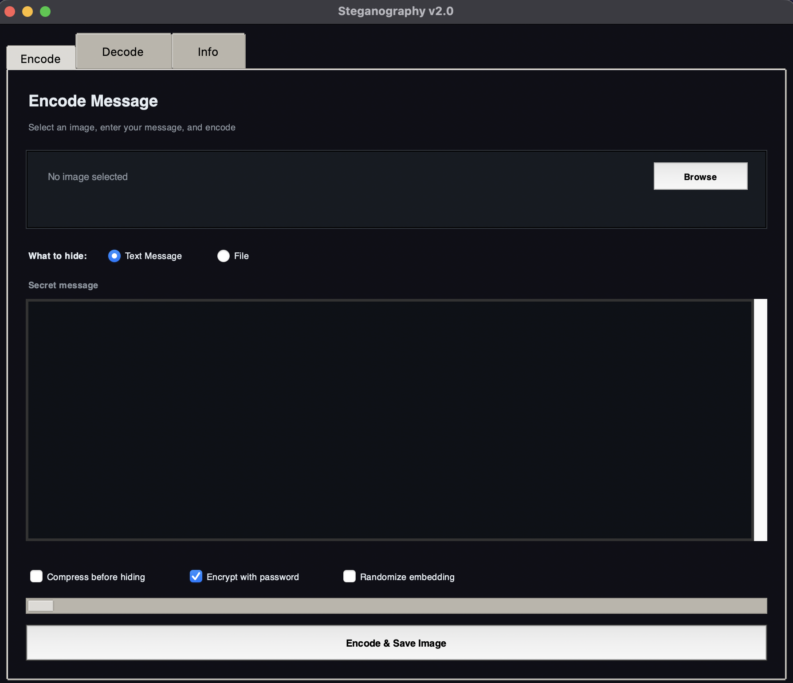
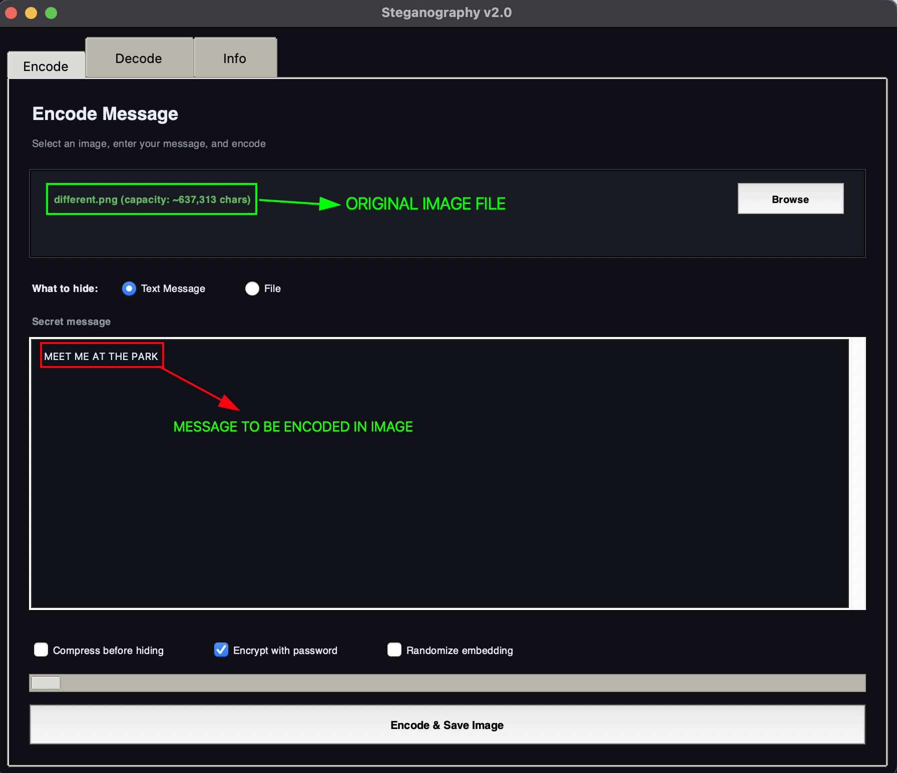
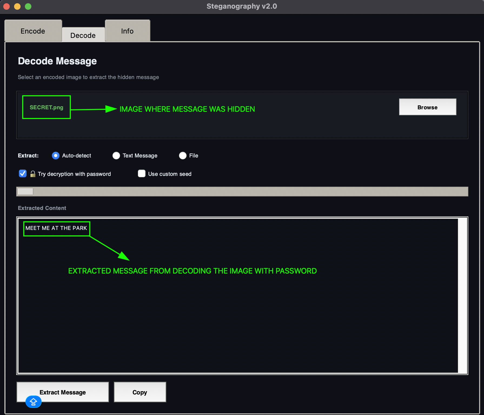

# Steganography Tool

## Overview

In this project, a steganography tool is built using python and it's libraries. Steganography tool is used for hiding secret information within the file that looks ordinary such as document, images, videos and audio files etc. The hidden data can only be extracted by the authorized party.

## Learning Objective

- Understanding data hiding techniques
- Learning to write function-based code
- Identifying security use cases
- Learning version control and packaging
- Gaining knowledge of various data carriers
- Understanding secure message transmission

## Features

- Hides messages in image pixels
- Clean Tkinter interface
- Tests all modules individually and together
- Validates inputs and handles errors

## Project Structure

```
.
├── main.py                     # Entry point
├── gui.py                      # Tkinter GUI
├── cli.py                      # CLI interface for Docker/headless use
├── encode.py                   # Encoding
├── decode.py                   # Decoding
├── crypto.py                   # Encryption/decryption utilities
├── compression.py              # Compression utilities
├── img_operation.py            # Image loading/saving operations
├── test_steganography.py       # Comprehensive unit tests
├── requirements.txt            # Python dependencies
├── Dockerfile                  # Docker image
├── README.md                   # This file
└── images/
```

## Installation

### Prerequisites

- Python 3.8+
- Tkinter (usually included with Python)

### Setup

```bash
# Clone the repository
git clone https://github.com/0xh4ck3rm4n/steganography-tool-coursework.git
cd steganography-tool-coursework

# Install dependencies
pip install -r requirements.txt

# Run the application
python main.py
```

**Expected Output**



**Encode Image**



**Decode Image**



## Running Tests

```bash
# Run all tests
python -m pytest test_steganography.py -v

# Or using unittest
python test_steganography.py

# Run specific test class
python -m pytest test_steganography.py::TestCrypto -v

# Run with coverage
pytest test_steganography.py --cov=.
```

## Pull and Run from GHCR

```bash
# Pull the latest image
docker pull --platform linux/amd64 ghcr.io/0xh4ck3rm4n/stegenography-tool-coursework:latest

# Encode a message into an image
docker run --platform linux/amd64 \
  -v $(pwd)/images:/app/images \
  ghcr.io/0xh4ck3rm4n/stegenography-tool-coursework \
  encode --image /app/images/input.png --message "your secret message" --output /app/images/output.png

# Decode a message from an image
ocker run --platform linux/amd64 \
  -v $(pwd)/images:/app/images \
  ghcr.io/0xh4ck3rm4n/stegenography-tool-coursework \
  decode --image /app/images/output.png
```

## Author

- **Gaurav Poudel** - Initial work and demonstration

## License

This project is licensed under the MIT License - See [License](/LICENSE) for more details
